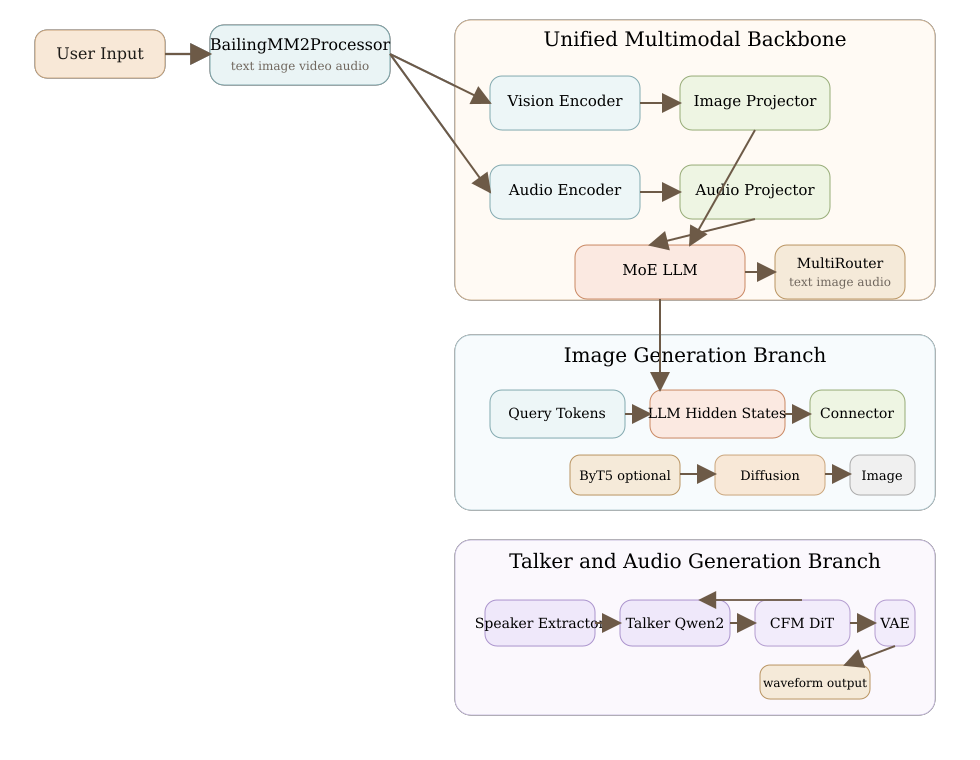
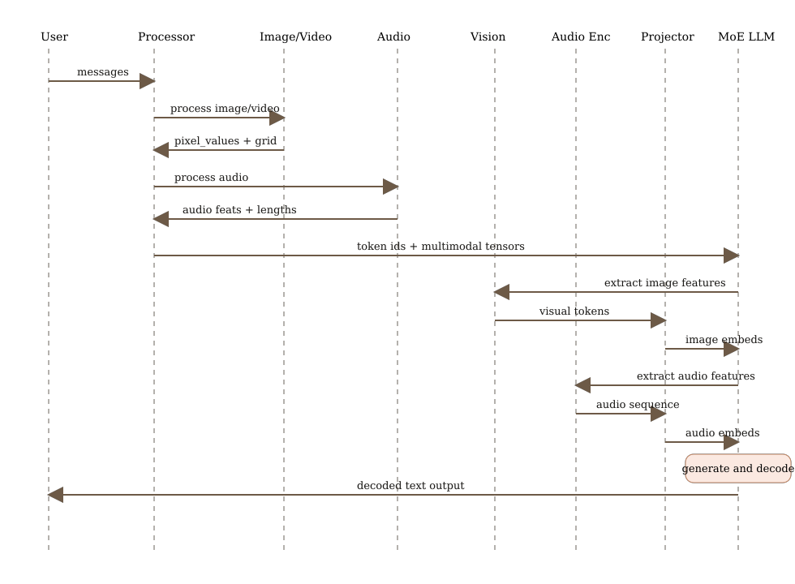
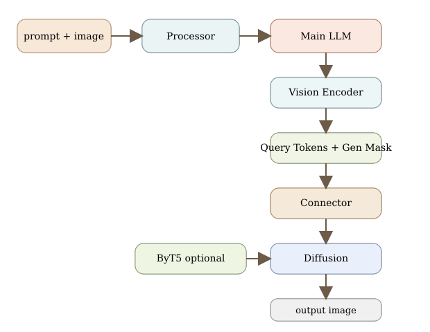
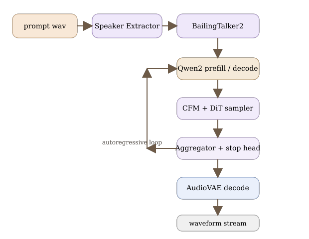
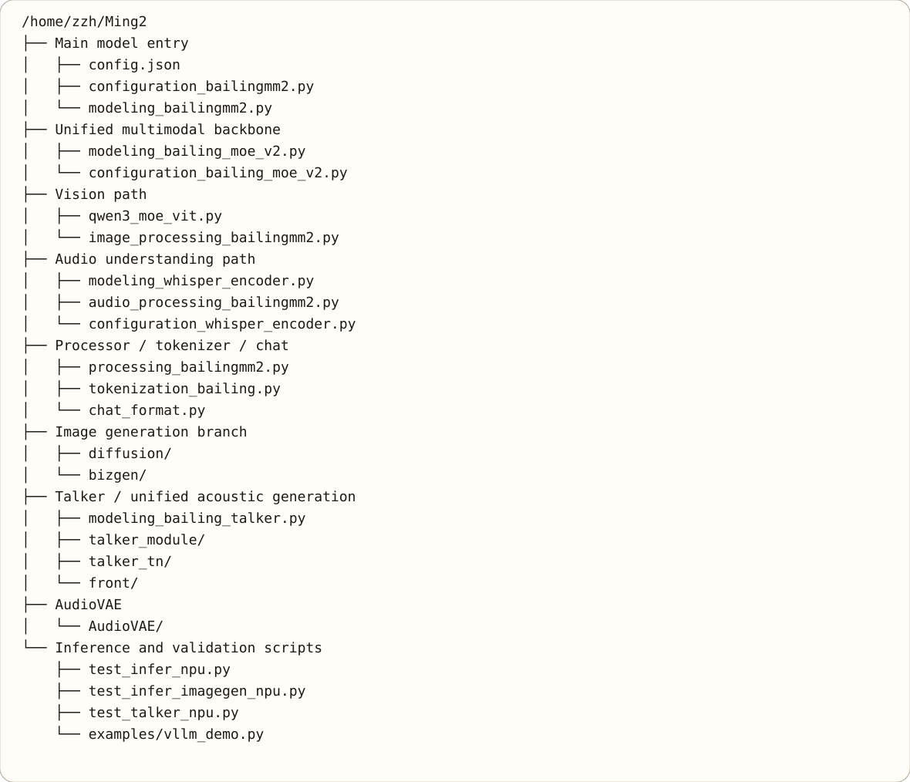
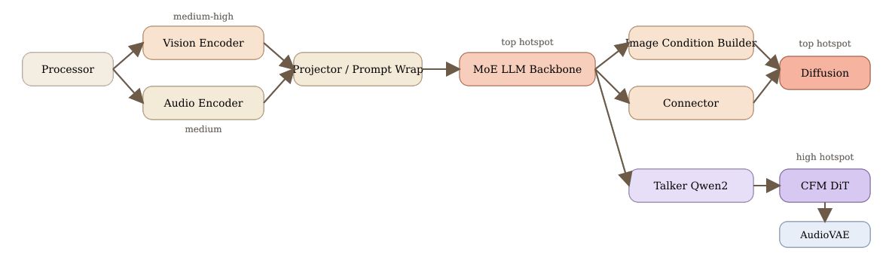

# Ming Architecture

基于当前仓库 `/home/zzh/Ming2` 的源码梳理，以下内容聚焦 `Ming-flash-omni 2.0` 主模型本体，不包含仓内独立工具子项目 `msAgent/`。

## 1. Overall Architecture

## 2. Understanding Inference Flow

## 3. Image Generation / Editing Flow

## 4. Talker / TTS / Audio Generation Flow

注：Talker 是通过 `load_talker=True` 可选加载的独立侧支，TTS 音频生成并不走主 `MoE LLM` 执行链路。

## 5. Code Map

## 6. Performance Hotspots

注：性能热点图中的 Talker 路径应理解为与主干并列的独立音频生成分支，而不是主 `MoE LLM` 的下游阶段。

## 7. Suggested Reading Order

1. `modeling_bailingmm2.py`
2. `processing_bailingmm2.py`
3. `modeling_bailing_moe_v2.py`
4. `qwen3_moe_vit.py`
5. `modeling_bailing_talker.py`
6. `diffusion/`
