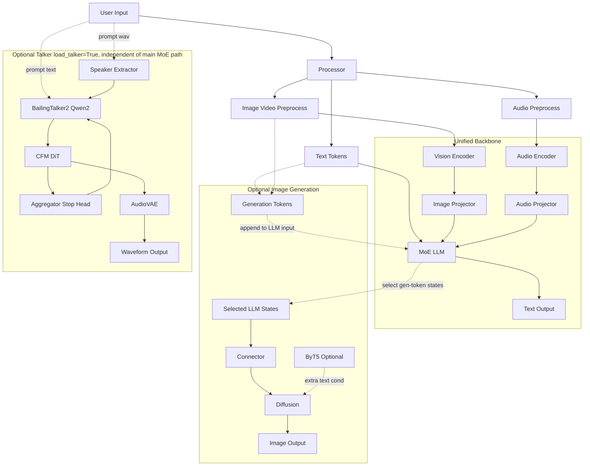
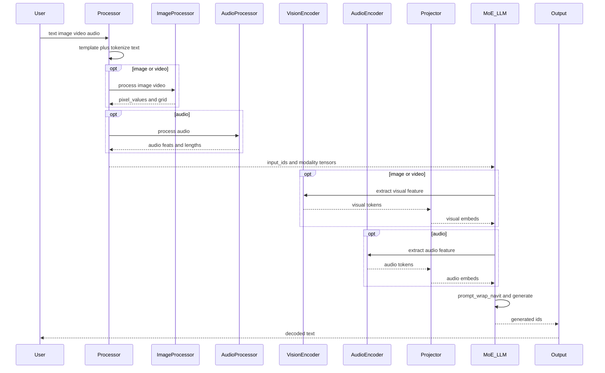
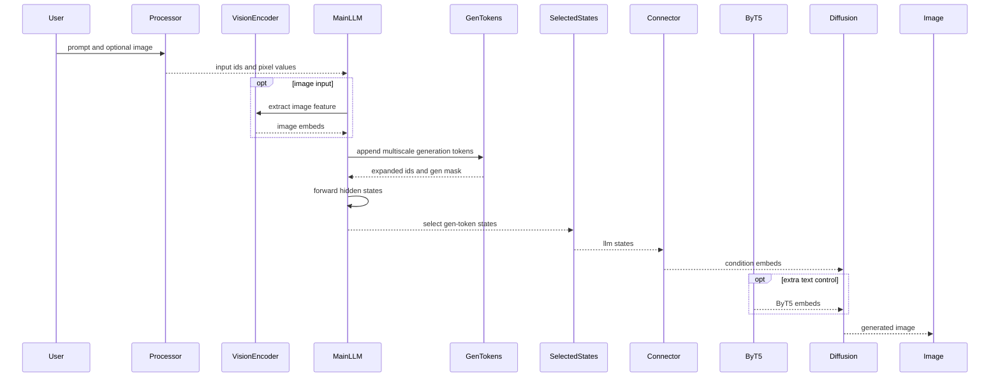
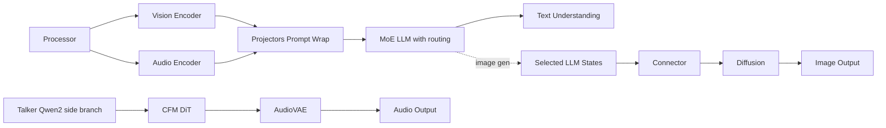

# Ming Architecture Simple

## 1. Overall Architecture



## 2. Understanding Flow



## 3. Image Generation Flow



Note: the Talker branch is loaded alongside the main model, but TTS generation does not execute through the main MoE LLM path.

## 4. Talker Flow

```mermaid
sequenceDiagram
    participant U as User
    participant S as SpeakerExtractor
    participant T as Talker
    participant Q as Qwen2
    participant C as CFM_DiT
    participant A as Aggregator
    participant H as StopHead
    participant V as AudioVAE
    participant W as Waveform

    Note over T,V: Optional side branch loaded with load_talker=True; no main MoE execution edge in TTS path

    U->>S: prompt wav
    S-->>T: speaker embedding
    U->>T: prompt text
    T->>Q: prefill embeds
    loop autoregressive audio
        Q-->>C: last hidden state
        C-->>A: next latent
        A-->>Q: next embeds
        Q-->>H: stop score
    end
    C-->>V: acoustic latents
    V-->>W: waveform
    W-->>U: audio
```

## 5. Performance Hotspots



Note: the hotspot diagram lists Talker separately on purpose; it is not a runtime child stage of the main MoE backbone.
